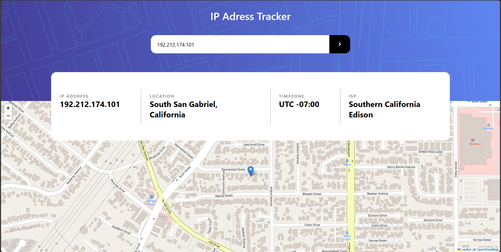
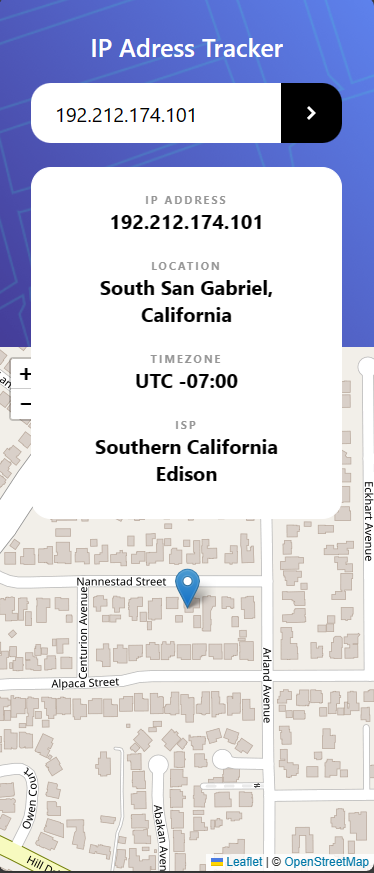

# Frontend Mentor - IP address tracker solution

This is a solution to the [IP address tracker challenge on Frontend Mentor](https://www.frontendmentor.io/challenges/ip-address-tracker-I8-0yYAH0). Frontend Mentor challenges help you improve your coding skills by building realistic projects. 

## Table of contents

- [Overview](#overview)
  - [The challenge](#the-challenge)
  - [Screenshot](#screenshot)
  - [Links](#links)
- [My process](#my-process)
  - [Built with](#built-with)
  - [What I learned](#what-i-learned)
  - [Continued development](#continued-development)
  - [Useful resources](#useful-resources)
- [Author](#author)
- [Acknowledgments](#acknowledgments)

**Note: Delete this note and update the table of contents based on what sections you keep.**

## Overview

### The challenge

Users should be able to:

- View the optimal layout for each page depending on their device's screen size
- See hover states for all interactive elements on the page
- See their own IP address on the map on the initial page load
- Search for any IP addresses or domains and see the key information and location

### Screenshot

#### Desktop

#### Mobile

### Links

- Solution URL: [Github](https://github.com/luccas-fialho/ip-tracker)
- Live Site URL: [Live Site](https://ip-tracker-two-gamma.vercel.app/)

## My process

### Built with

- Vanilla JavaScript
- Semantic HTML5 markup
- CSS custom properties
- Flexbox
- Mobile-first workflow

### What I learned

With this project i could learn more about DOM manipulation, async programming, fetch, promises and JS in general. I decided to do this challenge because i wanted to practice my Vanilla JS skills.

### Useful resources

- [Using the Fetch API](https://developer.mozilla.org/en-US/docs/Web/API/Fetch_API/Using_Fetch) - This helped me to remember how to use it in vanilla JS.

## Author

- Website - [Meu Portfolio](https://luccas-fialho.github.io/portfolio/)
- Frontend Mentor - [@luccas-fialho](https://www.frontendmentor.io/profile/luccas-fialho)
